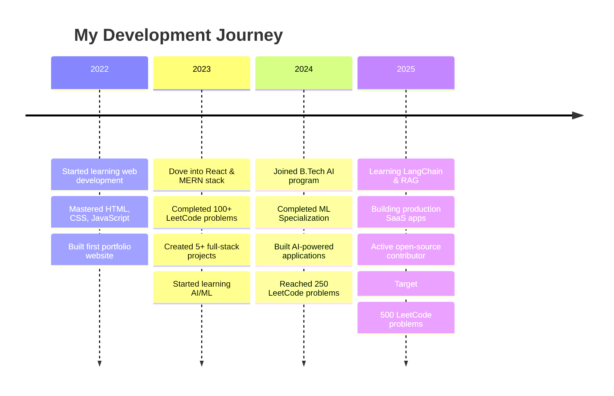

<div align="center">

<!-- Animated Header with Matrix Effect -->


<!-- Dynamic Typing Animation -->


<br/>

<!-- Social Badges -->
<p align="center">
  <a href="https://linkedin.com/in/jivit">
    
  </a>
  <a href="https://x.com/Jivit87">
    
  </a>
  <a href="mailto:jivit.rana2024@nst.rishihood.edu.in">
    
  </a>
  <a href="https://instagram.com/jivitrana">
    
  </a>
  <a href="#">
    
  </a>
</p>

<!-- Profile Stats -->
<p align="center">
  
  
  
</p>

</div>

<br/>

<!-- Navigation Bar -->
<div align="center">

[](#-about-me)
[](#-tech-stack--expertise)
[](#-featured-projects)
[](#-github-statistics)
[](#-my-coding-journey)
[](#-lets-connect)

</div>

<br/>


<!-- About Me Section -->
## 👨‍💻 About Me


```typescript
class Developer {
    name: string = "Jivit Rana";
    role: string = "Full-Stack Developer & AI Enthusiast";
    location: string = "India 🇮🇳";
    education: string = "B.Tech in Artificial Intelligence (1st Year)";
    
    code: string[] = [
        "JavaScript", "TypeScript", "Python", 
        "HTML/CSS", "Bash", "SQL"
    ];
    
    technologies = {
        frontEnd: {
            frameworks: ["React", "Next.js"],
            styling: ["TailwindCSS", "SASS", "CSS-in-JS"],
            stateManagement: ["Context API", "Redux"],
        },
        backEnd: {
            runtime: ["Node.js"],
            frameworks: ["Express.js", "FastAPI"],
            realtime: ["Socket.io"],
            authentication: ["JWT", "OAuth"]
        },
        databases: ["MongoDB", "Firebase", "PostgreSQL"],
        aiml: {
            frameworks: ["LangChain", "Scikit-learn"],
            libraries: ["NumPy", "Pandas", "Matplotlib"],
            tools: ["OpenAI API", "Hugging Face"]
        },
        devOps: ["Git", "GitHub Actions", "Docker"],
        design: ["Figma", "Framer", "Canva"]
    };
    
    currentlyLearning = [
        "Advanced RAG Systems",
        "Vector Databases (Pinecone)",
        "System Design Patterns",
        "Cloud Architecture (AWS)"
    ];
    
    achievements = {
        leetcode: "250+ problems solved",
        projects: "10+ production applications",
        certifications: ["Andrew Ng's ML Specialization"],
        contributions: "Active open-source contributor"
    };
    
    funFacts = [
        "☕ Coffee-driven developer",
        "🎯 Goal: 500 LeetCode problems by EOY",
        "📚 Reading 'Designing Data-Intensive Applications'",
        "🎮 Chess enthusiast when not coding"
    ];
    
    getMotivation(): string {
        return "Building the future, one commit at a time! 🚀";
    }
}

const jivit = new Developer();
console.log(jivit.getMotivation());
```

<br clear="right"/>

### 🎯 Quick Facts

- 🔭 Currently building **AI-powered productivity tools** with LangChain & Next.js
- 🌱 Learning **Advanced RAG techniques** and **Vector Databases**
- 👯 Looking to collaborate on **Open Source AI/ML projects**
- 💡 Passionate about **clean code**, **scalable architecture**, and **intelligent systems**
- 📫 Reach me at: **jivit.rana2024@nst.rishihood.edu.in**
- ⚡ Fun fact: **I turn coffee into code and bugs into features!** ☕→💻

<br/>


<!-- Tech Stack Section -->
## 💻 Tech Stack & Expertise

<details open>
<summary><b>🎨 Frontend Development</b></summary>
<br>

<div align="center">


</div>

**Skills:** Component Architecture • Responsive Design • State Management • Performance Optimization • SEO • Accessibility

</details>

<details open>
<summary><b>⚙️ Backend Development</b></summary>
<br>

<div align="center">


</div>

**Skills:** RESTful APIs • GraphQL • WebSockets • Authentication & Authorization • Microservices • Server-Side Rendering

</details>

<details open>
<summary><b>🗄️ Databases & Cloud Services</b></summary>
<br>

<div align="center">


</div>

**Skills:** Database Design • Query Optimization • Cloud Deployment • Serverless Functions • CDN • Caching Strategies

</details>

<details open>
<summary><b>🤖 AI/ML & Data Science</b></summary>
<br>

<div align="center">


</div>

**Skills:** Machine Learning • Deep Learning • NLP • RAG Systems • Prompt Engineering • Data Analysis & Visualization

</details>

<details open>
<summary><b>🛠️ Tools & Development Environment</b></summary>
<br>

<div align="center">


</div>

**Skills:** Version Control • CI/CD • Container Orchestration • API Testing • UI/UX Design • Project Management

</details>

<br/>

### 📈 Skill Proficiency

<div align="center">

| Skill | Proficiency | Years |
|:---:|:---:|:---:|
| **JavaScript/TypeScript** | ⭐⭐⭐⭐⭐ | 2+ years |
| **React/Next.js** | ⭐⭐⭐⭐⭐ | 2+ years |
| **Node.js/Express** | ⭐⭐⭐⭐⭐ | 2+ years |
| **Python** | ⭐⭐⭐⭐ | 1+ years |
| **MongoDB** | ⭐⭐⭐⭐ | 1+ years |
| **Machine Learning** | ⭐⭐⭐⭐ | 1+ years |
| **TailwindCSS** | ⭐⭐⭐⭐⭐ | 2+ years |
| **Git/GitHub** | ⭐⭐⭐⭐⭐ | 2+ years |

</div>

<br/>


<!-- Projects Section -->
## 🚀 Featured Projects

<div align="center">

### 🌟 Pinned Repositories

<table>
<tr>
<td width="50%">

<h3 align="center">🤖 AI Productivity Suite</h3>

<div align="center">
  <a href="#" target="_blank">
    
  </a>
  
  <p><strong>Tech Stack:</strong></p>
  <p>
    
    
    
  </p>
  
  <p><strong>🎯 Features:</strong></p>
  <p>✅ Smart task management with RAG<br/>
  ✅ Real-time collaboration<br/>
  ✅ AI-powered insights</p>
  
  <p>
    <a href="#" target="_blank">
      
    </a>
    <a href="#" target="_blank">
      
    </a>
  </p>
</div>

</td>
<td width="50%">

<h3 align="center">💬 Real-Time Chat Platform</h3>

<div align="center">
  <a href="#" target="_blank">
    
  </a>
  
  <p><strong>Tech Stack:</strong></p>
  <p>
    
    
    
  </p>
  
  <p><strong>🎯 Features:</strong></p>
  <p>✅ End-to-end encryption<br/>
  ✅ File sharing & media support<br/>
  ✅ Group chat functionality</p>
  
  <p>
    <a href="#" target="_blank">
      
    </a>
    <a href="#" target="_blank">
      
    </a>
  </p>
</div>

</td>
</tr>

<tr>
<td width="50%">

<h3 align="center">🎨 AI Image Generator</h3>

<div align="center">
  <a href="#" target="_blank">
    
  </a>
  
  <p><strong>Tech Stack:</strong></p>
  <p>
    
    
    
  </p>
  
  <p><strong>🎯 Features:</strong></p>
  <p>✅ Custom prompt engineering<br/>
  ✅ Image editing toolkit<br/>
  ✅ Style transfer capabilities</p>
  
  <p>
    <a href="#" target="_blank">
      
    </a>
    <a href="#" target="_blank">
      
    </a>
  </p>
</div>

</td>
<td width="50%">

<h3 align="center">📊 Full-Stack Dashboard</h3>

<div align="center">
  <a href="#" target="_blank">
    
  </a>
  
  <p><strong>Tech Stack:</strong></p>
  <p>
    
    
    
  </p>
  
  <p><strong>🎯 Features:</strong></p>
  <p>✅ Real-time analytics<br/>
  ✅ Responsive admin panel<br/>
  ✅ Data visualization</p>
  
  <p>
    <a href="#" target="_blank">
      
    </a>
    <a href="#" target="_blank">
      
    </a>
  </p>
</div>

</td>
</tr>
</table>

</div>

<details>
<summary><b>📂 View All Projects</b></summary>
<br/>

| 🎯 Project | 💻 Description | 🛠️ Stack | 🔗 Links |
|:-----------|:--------------|:----------|:---------|
| **E-Commerce Platform** | Full-featured online store with cart, payment integration | React, Node.js, MongoDB, Stripe | [Demo](#) • [Code](#) |
| **Task Management App** | Collaborative task tracker with real-time updates | Next.js, Firebase, TailwindCSS | [Demo](#) • [Code](#) |
| **Weather Dashboard** | Beautiful weather app with forecasts and maps | React, OpenWeather API, Chart.js | [Demo](#) • [Code](#) |
| **Portfolio Generator** | AI-powered portfolio website builder | Next.js, OpenAI API, MongoDB | [Demo](#) • [Code](#) |
| **Code Snippet Manager** | Developer tool for organizing code snippets | React, Node.js, PostgreSQL | [Demo](#) • [Code](#) |
| **Social Media Dashboard** | Analytics platform for social media metrics | MERN Stack, Chart.js, Socket.io | [Demo](#) • [Code](#) |

</details>

<br/>


<!-- GitHub Statistics -->
## 📊 GitHub Statistics

<div align="center">
  
   
  
  
  
</div>

<div align="center">
  
  
  
  
  
</div>

<div align="center">
  
  
  
</div>

<br/>

### 💻 LeetCode Journey

<div align="center">
  
  
  
  <br/><br/>
  
  **Current Progress:** 250+ Problems | **Target 2026:** 500+ Problems ⭐
  
</div>

<br/>


<!-- Coding Journey Timeline -->
## 🎯 My Coding Journey



<br/>

### 🏆 Major Milestones

<div align="center">

| Year | Achievement | Impact |
|:----:|:------------|:-------|
| **2025** | 🎓 Started B.Tech in AI | Deepening AI/ML knowledge |
| **2024** | 🏅 250+ LeetCode Problems | Strong DSA foundation |
| **2024** | 📜 ML Specialization | Solid ML fundamentals |
| **2023** | 🚀 10+ Production Apps | Real-world experience |
| **2022** | 💻 First Full-Stack App | Journey begins |

</div>

<br/>


<!-- Current Focus -->
## 🎯 What I'm Currently Up To

```javascript
const currentFocus = {
    learning: {
        primary: [
            "🤖 Advanced RAG Systems with LangChain",
            "🗄️ Vector Databases (Pinecone, Weaviate)",
            "🏗️ System Design & Architecture Patterns",
            "☁️ AWS Cloud Services & Deployment"
        ],
        secondary: [
            "🔐 Advanced Authentication Patterns",
            "📊 Data Engineering Concepts",
            "🐳 Docker & Kubernetes Basics",
            "🌐 Web3 & Blockchain Fundamentals"
        ]
    },
    
    building: {
        projects: [
            "💼 SaaS Product: AI Code Review Assistant",
            "🤝 Open Source: Contributing to LangChain",
            "📱 Mobile App: Cross-platform task manager",
            "🎨 Portfolio: Personal brand website"
        ],
        experiments: [
            "🧪 Testing new UI/UX patterns",
            "🔬 Exploring edge computing",
            "🎯 Performance optimization techniques"
        ]
    },
    
    reading: {
        books: [
            "📚 Designing Data-Intensive Applications - Martin Kleppmann",
            "📖 Clean Architecture - Robert C. Martin",
            "📕 Deep Learning - Ian Goodfellow"
        ],
        blogs: ["TechCrunch", "HackerNoon", "Dev.to", "Medium Engineering"]
    },
    
    goals2026: {
        technical: [
            "🎯 Reach 500+ LeetCode problems",
            "🌟 100+ open-source contributions",
            "🚀 Launch 3 SaaS products",
            "📜 Get AWS & TensorFlow certified"
        ],
        community: [
            "✍️ Write 24+ technical articles",
            "🎤 Speaker at 2+ tech conferences",
            "🤝 Mentor 50+ aspiring developers"
        ],
        personal: [
            "⚖️ Maintain work-life balance",
            "📚 Read 12 technical books",
            "🌐 Network with 100+ developers"
        ]
    }
};

console.log("Let's build something amazing! 🚀");
```

<br/>


<!-- Snake Animation -->
## 🐍 Contribution Graph

<div align="center">
  <picture>
    <source media="(prefers-color-scheme: dark)" srcset="https://raw.githubusercontent.com/Jivit87/Jivit87/output/github-contribution-grid-snake-dark.svg">
    <source media="(prefers-color-scheme: light)" srcset="https://raw.githubusercontent.com/Jivit87/Jivit87/output/github-contribution-grid-snake.svg">
    
  </picture>
</div>

<br/>


<!-- Dev Quote -->
## 💭 Developer Wisdom

<div align="center">
  
  
  
</div>

<br/>


<!-- Connect Section -->
## 🤝 Let's Connect!

<div align="center">

### 💬 I'm always excited to collaborate on interesting projects!

<br/>

<!-- Social Links with Better Styling -->
<table>
<tr>
<td align="center" width="33%">

### 💼 Professional

<a href="https://linkedin.com/in/jivit">
  
</a>
<br/>
<a href="#">
  
</a>
<br/>
<a href="mailto:jivit.rana2024@nst.rishihood.edu.in">
  
</a>

</td>
<td align="center" width="33%">

### 📱 Social

<a href="https://x.com/Jivit87">
  
</a>
<br/>
<a href="https://instagram.com/jivitrana">
  
</a>
<br/>
<a href="#">
  
</a>

</td>
<td align="center" width="33%">

### 💻 Coding

<a href="#">
  
</a>
<br/>
<a href="#">
  
</a>
<br/>
<a href="#">
  
</a>

</td>
</tr>
</table>

<br/>

### 📧 **Email:** jivit.rana2024@nst.rishihood.edu.in

### 💼 **Open to:**
- 🤝 Collaboration on innovative projects
- 💻 Freelance opportunities
- 🚀 Full-time positions
- 🎓 Mentorship & teaching
- 💡 Tech discussions

<br/>

**⚡ Response time: Usually within 24 hours**

</div>

<br/>


<!-- Support Section -->
## ☕ Support My Work

<div align="center">

### If you find my work valuable, consider supporting me! ☕

<br/>

<a href="https://www.buymeacoffee.com/jivit87">
  
</a>
&nbsp;&nbsp;
<a href="#">
  
</a>
&nbsp;&nbsp;
<a href="#">
  
</a>

<br/><br/>

### 🌟 **Or simply star my repositories!**

**Every star motivates me to create more awesome projects! ⭐**

</div>

<br/>


<!-- Footer -->
<div align="center">

### 📊 Profile Analytics

<br/>


<br/>

---

<br/>


<br/>

### 🌟 "First, solve the problem. Then, write the code." - John Johnson

### 💙 **Crafted with passion, powered by coffee, and driven by innovation**

<br/>

**© 2026 Jivit Rana • Built with ❤️ using Markdown & GitHub Magic**

**⚡ Keep Learning • Keep Building • Keep Growing**

<br/>


</div>
